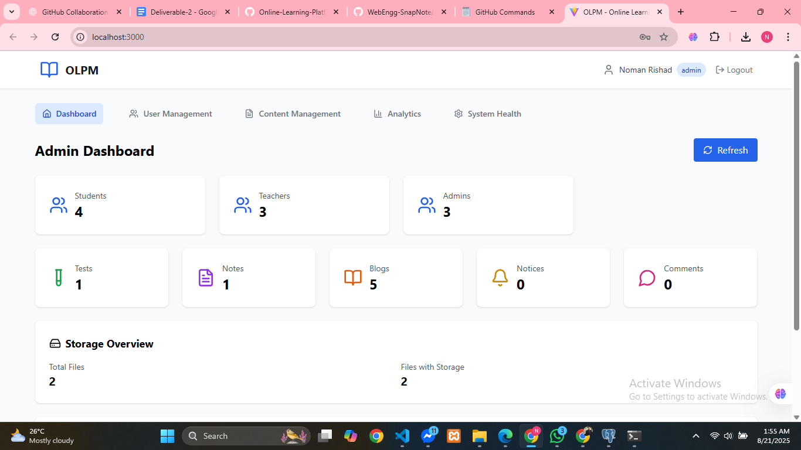
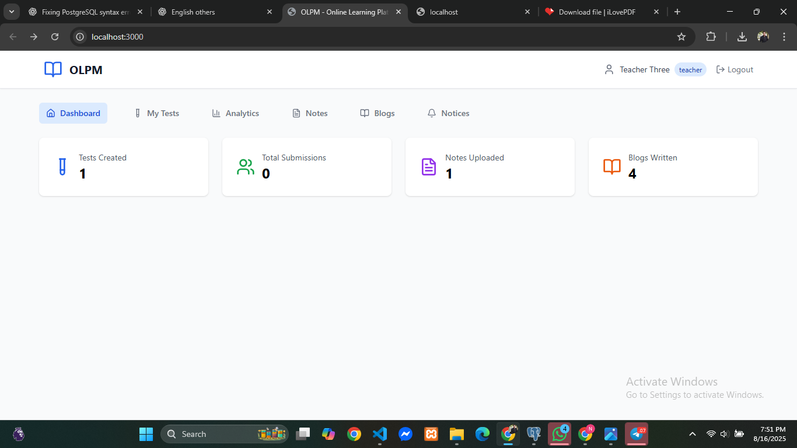
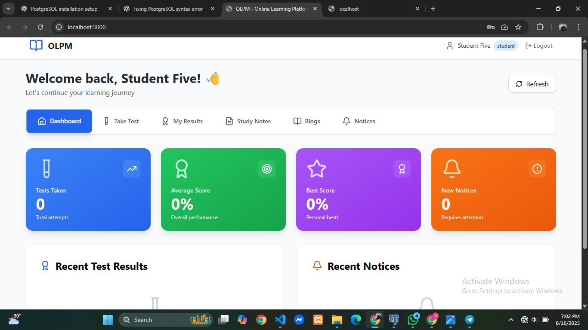
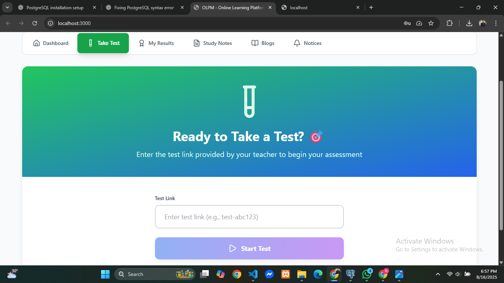
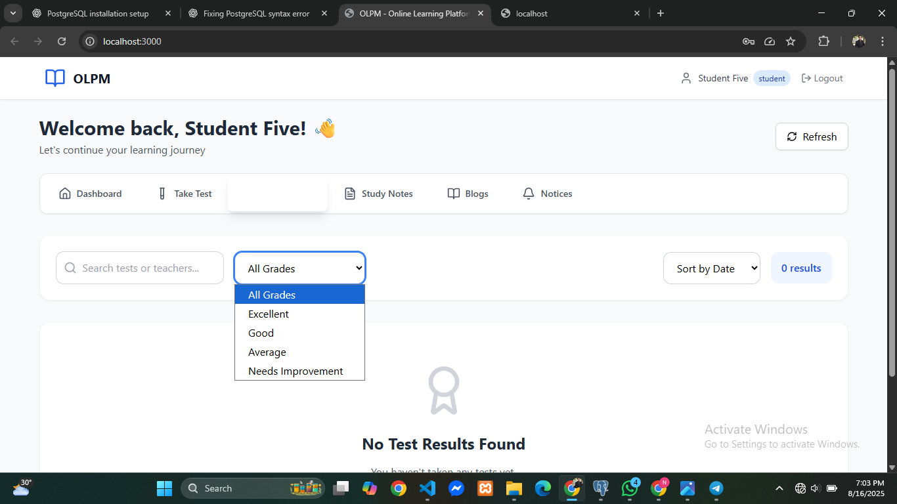

# 📑 Project Report: Online Learning Platform

## 1. Project Title

**Online Learning Platform**

---

## 2. Introduction

The **Online Learning Platform** is a web-based application designed to facilitate interactive learning and collaboration between teachers and students. It integrates modern web technologies to deliver a user-friendly, secure, and scalable solution for conducting online assessments, sharing notes, publishing notices, and fostering engagement through blogs.

---

## 3. Objectives

* To provide a seamless digital platform for **teachers and students**.
* To implement **role-based access** for secure operations.
* To enable **online test creation and automatic evaluation**.
* To support **file sharing and resource management**.
* To build a **notice board** for important announcements.
* To encourage interaction through a **blogging system**.

---

## 4. Functional Requirements

### A. User Management

* Registration & login for teachers and students.
* Role-based access control.
* Profile management.

### B. Test Management

* Teachers create MCQ tests.
* Unique test links for secure participation.
* Auto evaluation and result analysis.

### C. Notes and File Sharing

* Teachers upload learning materials.
* Students view/download notes.

### D. Notice Board

* Teachers post announcements.
* Students access notices easily.

### E. Blog System

* Both teachers and students can write blogs.
* Commenting and discussion features.

---

## 5. Non-Functional Requirements

* **Performance**: Support multiple users simultaneously.
* **Scalability**: System should expand with increased users/content.
* **Security**: Authentication, authorization, and data protection.
* **Availability**: High uptime, especially during exams.
* **Usability**: Responsive UI across devices.
* **Maintainability**: Modular code for easy updates.
* **Compatibility**: Works across major browsers.

---

## 6. User Stories

### Teacher

* Register & log in.
* Create and share MCQ tests.
* Upload notes and post notices.
* Publish blogs and comment on students’ posts.

### Student

* Register & log in.
* Access tests via links and view results.
* Download notes and view notices.
* Write blogs and participate in discussions.

---

## 7. Agile Sprint Planning

* **Sprint 1**: User Management
* **Sprint 2**: Test Management
* **Sprint 3**: Result Reporting
* **Sprint 4**: Notes/File Sharing
* **Sprint 5**: Blogging System
* **Sprint 6**: Notice Board
* **Sprint 7**: UI/UX improvements & bug fixes

---

## 8. Technical Stack

### Frontend

* ReactJS
* React Router
* Tailwind CSS / Material UI
* Form Validation: React Hook Form

### Backend

* Node.js + Express.js
* JWT Authentication
* RESTful APIs

### Database

* PostgreSQL (original design in MySQL, adapted to Postgres)

### Tools

* Git + GitHub
* Postman (API testing)
* pgAdmin (DB management)

---

## 9. Installation & Setup

### Clone Repository

```bash
git clone https://github.com/Tonmoy-Roy-CSE-CU/OnlineLearningPlatform.git
cd OnlineLearningPlatform
```

### Database Setup

```bash
createdb -U postgres olpm
psql -U postgres -d olpm -f backend/olpm.sql
```

### Backend

```bash
cd backend
npm install
node server.js
```

### Frontend

```bash
cd ../frontend1
npm install
npm run dev
```

Visit: 👉 [http://localhost:3000](http://localhost:3000)

---

## 10. Sample Credentials

| Role    | Email                                             | Password |
| ------- | ------------------------------------------------- | -------- |
| Admin   | [admin@example.com](mailto:admin@example.com)     | 123456   |
| Teacher | [teacher@example.com](mailto:teacher@example.com) | 123456   |
| Student | [student@example.com](mailto:student@example.com) | 123456   |

---


## 11. Key Interface Screenshots
[Place screenshots here]

Login/Register Page


Admin Dashboard


Teacher Dashboard


Student Dashboard


Student Take Test


Student See Results


## 12. Conclusion

The **Online Learning Platform** successfully integrates essential tools for digital education in one place. By combining **test management, notes sharing, blogging, and notice board features**, it fosters a collaborative academic environment. The system is designed with **scalability, security, and usability** in mind, ensuring it can adapt to future requirements and a larger user base.

---

